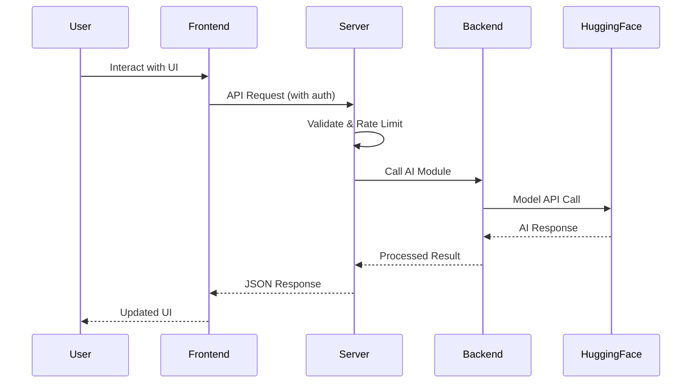

# Developer Guide - ScamSimAI

## 🚀 Overview

This comprehensive developer guide provides detailed technical information for contributors and developers working on the ScamSimAI project. It covers architecture, development workflows, testing strategies, and best practices.

## 🏗️ System Architecture

### High-Level Architecture

```
┌─────────────────────────────────────────────────────────────────┐
│                          User Interface                          │
│                     (Next.js Frontend)                          │
└─────────────────────┬───────────────────────────────────────────┘
                      │ HTTP/JSON API
┌─────────────────────▼───────────────────────────────────────────┐
│                    API Gateway Layer                            │
│                   (FastAPI Server)                              │
│  ┌─────────────┐ ┌─────────────┐ ┌─────────────┐               │
│  │ Rate Limiter│ │    CORS     │ │    Auth     │               │
│  └─────────────┘ └─────────────┘ └─────────────┘               │
└─────────────────────┬───────────────────────────────────────────┘
                      │ Module Imports
┌─────────────────────▼───────────────────────────────────────────┐
│                   AI Backend Layer                              │
│                (Python AI Modules)                              │
│  ┌─────────────────┐              ┌─────────────────┐           │
│  │ Text Generation │              │ Spam Detection  │           │
│  │    (LLaMA)      │              │   (Mistral)     │           │
│  └─────────────────┘              └─────────────────┘           │
└─────────────────────┬───────────────────────────────────────────┘
                      │ API Calls
┌─────────────────────▼───────────────────────────────────────────┐
│                External AI Services                             │
│                (Hugging Face Hub)                               │
└─────────────────────────────────────────────────────────────────┘
```

### Component Interaction Flow



## 🛠️ Development Environment Setup

### Prerequisites

#### System Requirements
- **Node.js**: 18.0.0 or higher
- **Python**: 3.11 or higher
- **Git**: Latest version
- **Code Editor**: VS Code recommended

#### Hardware Recommendations
- **RAM**: 8GB minimum, 16GB recommended
- **Storage**: 10GB free space for models and dependencies
- **Network**: Stable internet for AI model access

### Initial Setup

#### 1. Repository Setup
```bash
# Clone the repository
git clone https://github.com/yourusername/AI-Scammer-Simulation.git
cd AI-Scammer-Simulation

# Set up git hooks (optional but recommended)
cp .git/hooks/pre-commit.sample .git/hooks/pre-commit
chmod +x .git/hooks/pre-commit
```

#### 2. Backend Development Setup
```bash
# Create Python virtual environment
python -m venv venv

# Activate virtual environment
# Windows
venv\Scripts\activate
# macOS/Linux
source venv/bin/activate

# Install Python dependencies
pip install -r requirements.txt

# Or install individual packages
pip install fastapi uvicorn python-dotenv pydantic transformers torch requests
```

#### 3. Frontend Development Setup
```bash
cd frontend

# Install Node.js dependencies
npm install

# Install additional development tools (optional)
npm install --save-dev @types/node typescript eslint prettier
```

#### 4. Environment Configuration
```bash
# Server environment
cd server
cp .env.example .env
# Edit .env with your actual values

# Frontend environment
cd ../frontend
cp .env.local.example .env.local
# Edit .env.local with your actual values
```

### Development Workflow

#### Branch Strategy
```bash
# Feature development
git checkout main
git pull origin main
git checkout -b feature/your-feature-name

# Make changes, commit, and push
git add .
git commit -m "feat: add new feature description"
git push origin feature/your-feature-name

# Create pull request through GitHub
```

#### Daily Development Routine
```bash
# Start development servers
# Terminal 1: Backend server
cd server
python server.py

# Terminal 2: Frontend server
cd frontend
npm run dev

# Terminal 3: Development commands
# Run tests, check logs, etc.
```

## 🧪 Testing Strategy

### Backend Testing

#### Unit Tests
```python
# test_server.py
import pytest
from fastapi.testclient import TestClient
from server import app

client = TestClient(app)

def test_health_endpoint():
    """Test health check endpoint"""
    response = client.get("/api/health")
    assert response.status_code == 200
    assert response.json()["success"] is True

def test_auth_required():
    """Test authentication requirement"""
    response = client.post("/api/generate-reply", json={
        "conversation": "test",
        "persona": "scammer"
    })
    assert response.status_code == 401

def test_valid_generation():
    """Test text generation with valid auth"""
    headers = {"Authorization": "Bearer test-api-key"}
    response = client.post("/api/generate-reply", 
        json={
            "conversation": "Hello",
            "persona": "scammer",
            "style": "neutral"
        },
        headers=headers
    )
    assert response.status_code == 200
    assert "data" in response.json()

class TestRateLimiter:
    def test_rate_limiting(self):
        """Test rate limiting functionality"""
        from server import RateLimiter
        
        limiter = RateLimiter(max_requests=2, window_minutes=1)
        
        # First two requests should be allowed
        assert limiter.is_allowed("127.0.0.1") is True
        assert limiter.is_allowed("127.0.0.1") is True
        
        # Third request should be blocked
        assert limiter.is_allowed("127.0.0.1") is False

class TestInputValidation:
    def test_conversation_validation(self):
        """Test conversation input validation"""
        from server import GenerateRequest
        from pydantic import ValidationError
        
        # Valid input
        valid_request = GenerateRequest(
            conversation="Hello, how are you?",
            persona="scammer",
            style="neutral"
        )
        assert valid_request.conversation == "Hello, how are you?"
        
        # Invalid input - too short
        with pytest.raises(ValidationError):
            GenerateRequest(conversation="", persona="scammer")
        
        # Invalid input - XSS attempt
        with pytest.raises(ValidationError):
            GenerateRequest(
                conversation="<script>alert('xss')</script>",
                persona="scammer"
            )
```

#### Integration Tests
```python
# test_integration.py
import pytest
from unittest.mock import patch, MagicMock

class TestAIIntegration:
    @patch('backend.generative.genai4.generate_reply')
    def test_generation_integration(self, mock_generate):
        """Test integration with AI generation"""
        mock_generate.return_value = "Mocked AI response"
        
        headers = {"Authorization": "Bearer test-api-key"}
        response = client.post("/api/generate-reply",
            json={
                "conversation": "Test conversation",
                "persona": "scammer",
                "style": "urgent"
            },
            headers=headers
        )
        
        assert response.status_code == 200
        assert response.json()["data"] == "Mocked AI response"
        mock_generate.assert_called_once_with(
            "Test conversation", "scammer", "urgent"
        )

    @patch('backend.generative.mistral.classify_spam')
    def test_classification_integration(self, mock_classify):
        """Test integration with spam classification"""
        mock_classify.return_value = {
            "classification": "spam",
            "confidence": 0.95,
            "probabilities": {"spam": 0.95, "not_spam": 0.05}
        }
        
        headers = {"Authorization": "Bearer test-api-key"}
        response = client.post("/api/classify",
            json={"text": "URGENT: Click here to win!"},
            headers=headers
        )
        
        assert response.status_code == 200
        result = response.json()["data"]
        assert result["classification"] == "spam"
        assert result["confidence"] == 0.95
```

#### Running Tests
```bash
# Install test dependencies
pip install pytest pytest-asyncio httpx

# Run all tests
pytest

# Run with coverage
pytest --cov=server --cov-report=html

# Run specific test file
pytest test_server.py

# Run with verbose output
pytest -v
```

### Frontend Testing

#### Component Tests
```typescript
// __tests__/components/SpamCheck.test.tsx
import { render, screen, fireEvent, waitFor } from '@testing-library/react';
import SpamCheck from '@/components/SpamCheck';

// Mock API configuration
jest.mock('@/lib/api-config', () => ({
  API_CONFIG: { baseURL: 'http://localhost:8000' },
  getAuthHeaders: () => ({ 'Authorization': 'Bearer test-key' })
}));

describe('SpamCheck Component', () => {
  test('renders input and button', () => {
    render(<SpamCheck />);
    
    expect(screen.getByPlaceholderText(/enter text to check/i)).toBeInTheDocument();
    expect(screen.getByText(/check spam/i)).toBeInTheDocument();
  });

  test('validates input length', async () => {
    render(<SpamCheck />);
    
    const input = screen.getByPlaceholderText(/enter text to check/i);
    const button = screen.getByText(/check spam/i);
    
    // Test empty input
    fireEvent.click(button);
    await waitFor(() => {
      expect(screen.getByText(/input cannot be empty/i)).toBeInTheDocument();
    });
    
    // Test long input
    const longText = 'a'.repeat(5001);
    fireEvent.change(input, { target: { value: longText } });
    fireEvent.click(button);
    await waitFor(() => {
      expect(screen.getByText(/input too long/i)).toBeInTheDocument();
    });
  });

  test('makes API call on valid input', async () => {
    global.fetch = jest.fn(() =>
      Promise.resolve({
        ok: true,
        json: () => Promise.resolve({
          success: true,
          data: {
            classification: 'spam',
            confidence: 0.95
          }
        })
      })
    ) as jest.Mock;

    render(<SpamCheck />);
    
    const input = screen.getByPlaceholderText(/enter text to check/i);
    const button = screen.getByText(/check spam/i);
    
    fireEvent.change(input, { target: { value: 'Test spam message' } });
    fireEvent.click(button);
    
    await waitFor(() => {
      expect(global.fetch).toHaveBeenCalledWith(
        'http://localhost:8000/api/classify',
        expect.objectContaining({
          method: 'POST',
          headers: expect.objectContaining({
            'Authorization': 'Bearer test-key'
          }),
          body: JSON.stringify({ text: 'Test spam message' })
        })
      );
    });
  });
});
```

#### API Integration Tests
```typescript
// __tests__/api/api-config.test.ts
import { API_CONFIG, getAuthHeaders } from '@/lib/api-config';

describe('API Configuration', () => {
  beforeEach(() => {
    // Clear environment variables
    delete process.env.NEXT_PUBLIC_API_URL;
    delete process.env.NEXT_PUBLIC_API_KEY;
  });

  test('uses environment variables', () => {
    process.env.NEXT_PUBLIC_API_URL = 'https://test-api.com';
    process.env.NEXT_PUBLIC_API_KEY = 'test-key';
    
    // Re-import to get updated environment
    jest.resetModules();
    const { API_CONFIG } = require('@/lib/api-config');
    
    expect(API_CONFIG.baseURL).toBe('https://test-api.com');
    expect(API_CONFIG.apiKey).toBe('test-key');
  });

  test('getAuthHeaders returns correct format', () => {
    process.env.NEXT_PUBLIC_API_KEY = 'test-api-key';
    
    const headers = getAuthHeaders();
    
    expect(headers).toEqual({
      'Authorization': 'Bearer test-api-key',
      'Content-Type': 'application/json'
    });
  });
});
```

#### Running Frontend Tests
```bash
cd frontend

# Install test dependencies
npm install --save-dev jest @testing-library/react @testing-library/jest-dom @types/jest

# Run tests
npm test

# Run tests with coverage
npm test -- --coverage

# Run tests in watch mode
npm test -- --watch
```

## 🔧 Development Tools & Workflows

### Code Quality Tools

#### Python Code Quality
```bash
# Install development tools
pip install black isort flake8 mypy pytest-cov

# Format code
black server/ backend/

# Sort imports
isort server/ backend/

# Lint code
flake8 server/ backend/

# Type checking
mypy server/server.py
```

#### TypeScript Code Quality
```bash
cd frontend

# Install development tools
npm install --save-dev eslint prettier @typescript-eslint/parser @typescript-eslint/eslint-plugin

# Lint code
npm run lint

# Format code
npx prettier --write .

# Type checking
npx tsc --noEmit
```

#### Pre-commit Configuration
```yaml
# .pre-commit-config.yaml
repos:
  - repo: https://github.com/psf/black
    rev: 23.1.0
    hooks:
      - id: black
        language_version: python3.11

  - repo: https://github.com/pycqa/isort
    rev: 5.12.0
    hooks:
      - id: isort

  - repo: https://github.com/pycqa/flake8
    rev: 6.0.0
    hooks:
      - id: flake8

  - repo: https://github.com/pre-commit/mirrors-prettier
    rev: v3.0.0-alpha.4
    hooks:
      - id: prettier
        files: \.(js|ts|tsx|json|css|md)$
```

### Debugging Strategies

#### Backend Debugging
```python
# Debug logging configuration
import logging

# Set up detailed logging
logging.basicConfig(
    level=logging.DEBUG,
    format='%(asctime)s - %(name)s - %(levelname)s - %(message)s',
    handlers=[
        logging.FileHandler('debug.log'),
        logging.StreamHandler()
    ]
)

# Add debug middleware
@app.middleware("http")
async def debug_middleware(request: Request, call_next):
    logger.debug(f"Request: {request.method} {request.url}")
    logger.debug(f"Headers: {dict(request.headers)}")
    
    response = await call_next(request)
    
    logger.debug(f"Response: {response.status_code}")
    return response

# Debug specific functions
def debug_generation(conversation: str, persona: str, style: str):
    logger.debug(f"Generation input: {conversation[:100]}...")
    logger.debug(f"Persona: {persona}, Style: {style}")
    
    result = generate_reply(conversation, persona, style)
    
    logger.debug(f"Generation output: {result[:100]}...")
    return result
```

#### Frontend Debugging
```typescript
// Debug utilities
export const debugLog = (message: string, data?: any) => {
  if (process.env.NODE_ENV === 'development') {
    console.log(`[DEBUG] ${message}`, data);
  }
};

// API debugging
const makeApiCall = async (endpoint: string, data: any) => {
  debugLog(`API Call to ${endpoint}`, data);
  
  try {
    const response = await fetch(`${API_CONFIG.baseURL}${endpoint}`, {
      method: 'POST',
      headers: getAuthHeaders(),
      body: JSON.stringify(data)
    });
    
    debugLog(`API Response ${response.status}`, await response.clone().json());
    return response;
  } catch (error) {
    debugLog(`API Error`, error);
    throw error;
  }
};

// Component debugging
const SpamCheck: React.FC = () => {
  const [inputText, setInputText] = useState('');
  
  useEffect(() => {
    debugLog('SpamCheck mounted');
    return () => debugLog('SpamCheck unmounted');
  }, []);
  
  useEffect(() => {
    debugLog('Input text changed', inputText);
  }, [inputText]);
  
  // Component implementation
};
```

### Performance Monitoring

#### Backend Performance
```python
import time
from functools import wraps
from typing import Dict, List
import asyncio

class PerformanceMonitor:
    def __init__(self):
        self.metrics: Dict[str, List[float]] = {}
    
    def record_time(self, operation: str, duration: float):
        if operation not in self.metrics:
            self.metrics[operation] = []
        self.metrics[operation].append(duration)
    
    def get_average_time(self, operation: str) -> float:
        times = self.metrics.get(operation, [])
        return sum(times) / len(times) if times else 0
    
    def get_stats(self) -> Dict[str, Dict[str, float]]:
        stats = {}
        for operation, times in self.metrics.items():
            if times:
                stats[operation] = {
                    'avg': sum(times) / len(times),
                    'min': min(times),
                    'max': max(times),
                    'count': len(times)
                }
        return stats

monitor = PerformanceMonitor()

def track_performance(operation_name: str):
    def decorator(func):
        @wraps(func)
        async def wrapper(*args, **kwargs):
            start_time = time.time()
            try:
                result = await func(*args, **kwargs)
                return result
            finally:
                duration = time.time() - start_time
                monitor.record_time(operation_name, duration)
                
                if duration > 1.0:  # Log slow operations
                    logger.warning(f"Slow operation {operation_name}: {duration:.2f}s")
        return wrapper
    return decorator

# Usage
@track_performance("generate_reply")
async def generate_reply_endpoint(request: GenerateRequest):
    # Implementation
    pass
```

#### Frontend Performance
```typescript
// Performance monitoring utilities
export const performanceMonitor = {
  startTimer: (label: string) => {
    performance.mark(`${label}-start`);
  },
  
  endTimer: (label: string) => {
    performance.mark(`${label}-end`);
    performance.measure(label, `${label}-start`, `${label}-end`);
    
    const measure = performance.getEntriesByName(label)[0];
    if (measure.duration > 1000) {
      console.warn(`Slow operation ${label}: ${measure.duration.toFixed(2)}ms`);
    }
    
    return measure.duration;
  },
  
  getMetrics: () => {
    return performance.getEntriesByType('measure');
  }
};

// Usage in components
const SpamCheck: React.FC = () => {
  const handleCheckSpam = async () => {
    performanceMonitor.startTimer('spam-check');
    
    try {
      const response = await fetch(/* API call */);
      // Handle response
    } finally {
      performanceMonitor.endTimer('spam-check');
    }
  };
  
  return (
    // Component JSX
  );
};

// Performance reporting
useEffect(() => {
  const interval = setInterval(() => {
    const metrics = performanceMonitor.getMetrics();
    console.log('Performance metrics:', metrics);
  }, 30000); // Every 30 seconds
  
  return () => clearInterval(interval);
}, []);
```

## 🚦 Deployment & DevOps

### CI/CD Pipeline

#### GitHub Actions Workflow
```yaml
# .github/workflows/ci.yml
name: CI/CD Pipeline

on:
  push:
    branches: [ main, develop ]
  pull_request:
    branches: [ main ]

jobs:
  test-backend:
    runs-on: ubuntu-latest
    
    steps:
    - uses: actions/checkout@v3
    
    - name: Set up Python
      uses: actions/setup-python@v4
      with:
        python-version: '3.11'
    
    - name: Install dependencies
      run: |
        python -m pip install --upgrade pip
        pip install -r requirements.txt
        pip install pytest pytest-cov
    
    - name: Run tests
      run: |
        cd server
        pytest --cov=. --cov-report=xml
    
    - name: Upload coverage
      uses: codecov/codecov-action@v3
      with:
        file: ./server/coverage.xml

  test-frontend:
    runs-on: ubuntu-latest
    
    steps:
    - uses: actions/checkout@v3
    
    - name: Set up Node.js
      uses: actions/setup-node@v3
      with:
        node-version: '18'
        cache: 'npm'
        cache-dependency-path: frontend/package-lock.json
    
    - name: Install dependencies
      run: |
        cd frontend
        npm ci
    
    - name: Run tests
      run: |
        cd frontend
        npm test -- --coverage --watchAll=false
    
    - name: Build
      run: |
        cd frontend
        npm run build

  security-scan:
    runs-on: ubuntu-latest
    
    steps:
    - uses: actions/checkout@v3
    
    - name: Run security scan
      run: |
        # Check for secrets
        git log --all --grep="password\|secret\|key" --oneline
        
        # Check dependencies
        cd frontend && npm audit
        cd ../server && pip list --outdated

  deploy:
    needs: [test-backend, test-frontend, security-scan]
    runs-on: ubuntu-latest
    if: github.ref == 'refs/heads/main'
    
    steps:
    - uses: actions/checkout@v3
    
    - name: Deploy to production
      run: |
        echo "Deploy to production server"
        # Add deployment scripts here
```

### Docker Configuration

#### Multi-stage Dockerfile
```dockerfile
# Dockerfile
FROM node:18-alpine AS frontend-builder

WORKDIR /app/frontend
COPY frontend/package*.json ./
RUN npm ci --only=production

COPY frontend/ ./
RUN npm run build

FROM python:3.11-slim AS backend-base

WORKDIR /app
COPY server/requirements.txt ./
RUN pip install --no-cache-dir -r requirements.txt

COPY server/ ./server/
COPY backend/ ./backend/

FROM backend-base AS production

# Copy frontend build
COPY --from=frontend-builder /app/frontend/out ./static/

EXPOSE 8000

CMD ["python", "server/server.py"]
```

#### Docker Compose
```yaml
# docker-compose.yml
version: '3.8'

services:
  app:
    build: .
    ports:
      - "8000:8000"
    environment:
      - API_KEY=${API_KEY}
      - HF_TOKEN_PRED=${HF_TOKEN_PRED}
      - HF_TOKEN_GEN=${HF_TOKEN_GEN}
      - ENVIRONMENT=production
    volumes:
      - ./logs:/app/logs
    restart: unless-stopped

  nginx:
    image: nginx:alpine
    ports:
      - "80:80"
      - "443:443"
    volumes:
      - ./nginx.conf:/etc/nginx/nginx.conf
      - ./ssl:/etc/ssl
    depends_on:
      - app
    restart: unless-stopped

volumes:
  logs:
```

### Monitoring & Logging

#### Production Logging
```python
# logging_config.py
import logging
import logging.handlers
import json
from datetime import datetime

class JSONFormatter(logging.Formatter):
    def format(self, record):
        log_entry = {
            'timestamp': datetime.utcnow().isoformat(),
            'level': record.levelname,
            'message': record.getMessage(),
            'module': record.module,
            'function': record.funcName,
            'line': record.lineno
        }
        
        if hasattr(record, 'user_ip'):
            log_entry['user_ip'] = record.user_ip
        
        if hasattr(record, 'endpoint'):
            log_entry['endpoint'] = record.endpoint
        
        return json.dumps(log_entry)

def setup_logging():
    """Set up production logging configuration"""
    
    # Create formatters
    json_formatter = JSONFormatter()
    console_formatter = logging.Formatter(
        '%(asctime)s - %(name)s - %(levelname)s - %(message)s'
    )
    
    # Create handlers
    file_handler = logging.handlers.RotatingFileHandler(
        'app.log', maxBytes=10*1024*1024, backupCount=5
    )
    file_handler.setFormatter(json_formatter)
    
    console_handler = logging.StreamHandler()
    console_handler.setFormatter(console_formatter)
    
    # Configure root logger
    logging.basicConfig(
        level=logging.INFO,
        handlers=[file_handler, console_handler]
    )
    
    # Create security logger
    security_logger = logging.getLogger('security')
    security_handler = logging.handlers.RotatingFileHandler(
        'security.log', maxBytes=10*1024*1024, backupCount=10
    )
    security_handler.setFormatter(json_formatter)
    security_logger.addHandler(security_handler)
    
    return logging.getLogger(__name__)
```

#### Health Monitoring
```python
# health_monitor.py
import psutil
import time
from dataclasses import dataclass
from typing import Dict, Any

@dataclass
class HealthMetrics:
    cpu_percent: float
    memory_percent: float
    disk_percent: float
    active_connections: int
    uptime_seconds: float

class HealthMonitor:
    def __init__(self):
        self.start_time = time.time()
    
    def get_metrics(self) -> HealthMetrics:
        return HealthMetrics(
            cpu_percent=psutil.cpu_percent(),
            memory_percent=psutil.virtual_memory().percent,
            disk_percent=psutil.disk_usage('/').percent,
            active_connections=len(psutil.net_connections()),
            uptime_seconds=time.time() - self.start_time
        )
    
    def get_health_status(self) -> Dict[str, Any]:
        metrics = self.get_metrics()
        
        status = {
            'status': 'healthy',
            'timestamp': time.time(),
            'metrics': {
                'cpu_percent': metrics.cpu_percent,
                'memory_percent': metrics.memory_percent,
                'disk_percent': metrics.disk_percent,
                'active_connections': metrics.active_connections,
                'uptime_seconds': metrics.uptime_seconds
            }
        }
        
        # Determine health status
        if (metrics.cpu_percent > 90 or 
            metrics.memory_percent > 90 or 
            metrics.disk_percent > 95):
            status['status'] = 'unhealthy'
        elif (metrics.cpu_percent > 70 or 
              metrics.memory_percent > 70 or 
              metrics.disk_percent > 85):
            status['status'] = 'degraded'
        
        return status

# Add to FastAPI app
health_monitor = HealthMonitor()

@app.get("/api/health/detailed")
async def detailed_health():
    return health_monitor.get_health_status()
```

## 📋 Contributing Guidelines

### Code Style Guidelines

#### Python Code Style
```python
# Follow PEP 8 standards
# Use type hints
def process_text(text: str, max_length: int = 1000) -> str:
    """Process input text with length validation.
    
    Args:
        text: Input text to process
        max_length: Maximum allowed text length
        
    Returns:
        Processed text string
        
    Raises:
        ValueError: If text exceeds max_length
    """
    if len(text) > max_length:
        raise ValueError(f"Text too long: {len(text)} > {max_length}")
    
    return text.strip().lower()

# Use dataclasses for structured data
from dataclasses import dataclass
from typing import Optional

@dataclass
class GenerationResult:
    text: str
    confidence: float
    model_used: str
    processing_time: float
    metadata: Optional[Dict[str, Any]] = None
```

#### TypeScript Code Style
```typescript
// Use strict TypeScript configuration
// Define proper interfaces
interface ApiResponse<T> {
  success: boolean;
  data?: T;
  error?: string;
  timestamp: string;
}

interface GenerationRequest {
  conversation: string;
  persona: 'scammer' | 'victim';
  style: 'neutral' | 'urgent' | 'friendly';
}

// Use proper error handling
const makeApiCall = async <T>(
  endpoint: string, 
  data: unknown
): Promise<ApiResponse<T>> => {
  try {
    const response = await fetch(`${API_CONFIG.baseURL}${endpoint}`, {
      method: 'POST',
      headers: getAuthHeaders(),
      body: JSON.stringify(data)
    });
    
    if (!response.ok) {
      throw new Error(`HTTP ${response.status}: ${response.statusText}`);
    }
    
    return await response.json();
  } catch (error) {
    console.error(`API call failed: ${endpoint}`, error);
    throw error;
  }
};

// Use proper component typing
interface SpamCheckProps {
  onResult?: (result: ClassificationResult) => void;
  maxLength?: number;
  disabled?: boolean;
}

const SpamCheck: React.FC<SpamCheckProps> = ({ 
  onResult, 
  maxLength = 5000, 
  disabled = false 
}) => {
  // Component implementation
};
```

### Pull Request Process

#### 1. Pre-submission Checklist
- [ ] Code follows style guidelines
- [ ] All tests pass
- [ ] Documentation updated
- [ ] Security considerations addressed
- [ ] Performance impact assessed
- [ ] Backward compatibility maintained

#### 2. PR Template
```markdown
## Description
Brief description of changes

## Type of Change
- [ ] Bug fix
- [ ] New feature
- [ ] Breaking change
- [ ] Documentation update
- [ ] Performance improvement
- [ ] Security enhancement

## Testing
- [ ] Unit tests added/updated
- [ ] Integration tests pass
- [ ] Manual testing completed

## Security Considerations
- [ ] No sensitive data exposed
- [ ] Input validation implemented
- [ ] Authentication/authorization maintained

## Documentation
- [ ] Code comments added
- [ ] README updated if needed
- [ ] API documentation updated

## Screenshots (if applicable)
Include screenshots for UI changes
```

#### 3. Review Criteria
- **Functionality**: Does the code work as intended?
- **Security**: Are security best practices followed?
- **Performance**: Will this impact system performance?
- **Maintainability**: Is the code clean and well-documented?
- **Testing**: Are there adequate tests?

### Release Process

#### Version Management
```bash
# Semantic versioning: MAJOR.MINOR.PATCH
# MAJOR: Breaking changes
# MINOR: New features (backward compatible)
# PATCH: Bug fixes

# Create release branch
git checkout main
git pull origin main
git checkout -b release/v2.1.0

# Update version numbers
# Update CHANGELOG.md
# Test thoroughly

# Merge to main
git checkout main
git merge release/v2.1.0
git tag v2.1.0
git push origin main --tags
```

#### Changelog Management
```markdown
# Changelog

## [2.1.0] - 2025-07-26

### Added
- Enhanced rate limiting with progressive blocking
- Comprehensive security logging
- Performance monitoring endpoints

### Changed
- Improved error handling in AI modules
- Updated dependencies to latest versions

### Fixed
- Fixed authentication issue in SpamCheck component
- Resolved memory leak in rate limiter

### Security
- Added input sanitization for XSS prevention
- Implemented token rotation procedures
```

## 🔧 Troubleshooting Common Issues

### Development Issues

#### Backend Issues
```python
# Issue: Import errors for backend modules
# Solution: Check Python path and module structure
import sys
import os

# Add backend directory to path
sys.path.append(os.path.join(os.path.dirname(__file__), '..', 'backend'))

# Now imports should work
from generative.genai4 import generate_reply

# Issue: Hugging Face authentication errors
# Solution: Verify tokens and network connectivity
def test_hf_connection():
    import requests
    
    token = os.getenv("HF_TOKEN_GEN")
    headers = {"Authorization": f"Bearer {token}"}
    
    response = requests.get(
        "https://huggingface.co/api/whoami",
        headers=headers
    )
    
    if response.status_code == 200:
        print("HF token is valid")
    else:
        print(f"HF token issue: {response.status_code}")
```

#### Frontend Issues
```typescript
// Issue: CORS errors in development
// Solution: Check server CORS configuration and frontend URL

// Issue: Environment variables not loading
// Solution: Restart development server after .env changes
const checkEnvVars = () => {
  const required = ['NEXT_PUBLIC_API_URL', 'NEXT_PUBLIC_API_KEY'];
  const missing = required.filter(key => !process.env[key]);
  
  if (missing.length > 0) {
    console.error('Missing environment variables:', missing);
    return false;
  }
  
  return true;
};

// Issue: Build errors
// Solution: Check TypeScript errors and dependency conflicts
```

### Production Issues

#### Performance Issues
```python
# Issue: High CPU usage
# Solution: Monitor and optimize AI model calls
def optimize_model_calls():
    # Implement caching
    import functools
    
    @functools.lru_cache(maxsize=128)
    def cached_generation(conversation_hash: str):
        # Expensive AI operation
        pass
    
    # Batch requests
    async def batch_process(requests: List[str]):
        # Process multiple requests together
        pass
    
    # Use async processing
    import asyncio
    
    async def async_generate(text: str):
        # Non-blocking AI calls
        pass
```

#### Memory Issues
```python
# Issue: Memory leaks
# Solution: Proper resource cleanup
import gc
import weakref

class ResourceManager:
    def __init__(self):
        self._resources = weakref.WeakSet()
    
    def register(self, resource):
        self._resources.add(resource)
    
    def cleanup(self):
        for resource in self._resources:
            if hasattr(resource, 'cleanup'):
                resource.cleanup()
        gc.collect()

# Use context managers
from contextlib import contextmanager

@contextmanager
def ai_model_context():
    model = load_model()
    try:
        yield model
    finally:
        del model
        gc.collect()
```

## 📚 Additional Resources

### Learning Resources
- [FastAPI Documentation](https://fastapi.tiangolo.com/)
- [Next.js Documentation](https://nextjs.org/docs)
- [Hugging Face Documentation](https://huggingface.co/docs)
- [Python Async Programming](https://docs.python.org/3/library/asyncio.html)
- [React Testing Library](https://testing-library.com/docs/react-testing-library/intro/)

### Development Tools
- [Postman](https://www.postman.com/) - API testing
- [React Developer Tools](https://react.dev/learn/react-developer-tools) - Frontend debugging
- [Python Debugger (pdb)](https://docs.python.org/3/library/pdb.html) - Backend debugging
- [Sentry](https://sentry.io/) - Error monitoring
- [Prometheus](https://prometheus.io/) - Metrics collection

### Community
- [GitHub Discussions](https://github.com/features/discussions) - Project discussions
- [Stack Overflow](https://stackoverflow.com/) - Technical questions
- [Reddit r/FastAPI](https://www.reddit.com/r/FastAPI/) - FastAPI community
- [Next.js Discord](https://nextjs.org/discord) - Next.js community

## 🎯 Future Development

### Planned Features
- **Multi-language Support**: Internationalization for frontend
- **Advanced AI Models**: Integration with newer language models
- **Real-time Features**: WebSocket support for live conversations
- **Analytics Dashboard**: User interaction analytics
- **Mobile Application**: React Native mobile app

### Technical Improvements
- **Database Integration**: Persistent storage for conversations
- **Caching Layer**: Redis for improved performance
- **Microservices**: Split into smaller, focused services
- **Container Orchestration**: Kubernetes deployment
- **Advanced Monitoring**: Comprehensive observability stack

### Contributing Opportunities
- [ ] Improve test coverage
- [ ] Add more AI model integrations
- [ ] Enhance UI/UX design
- [ ] Optimize performance
- [ ] Add documentation
- [ ] Fix reported bugs
- [ ] Implement feature requests

---

This developer guide is a living document. Please help keep it updated by contributing improvements and corrections!
